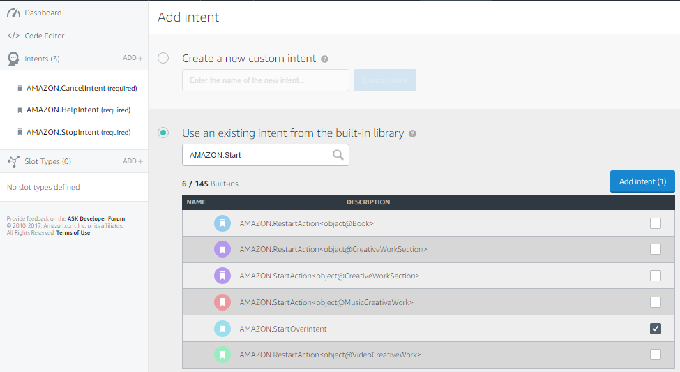
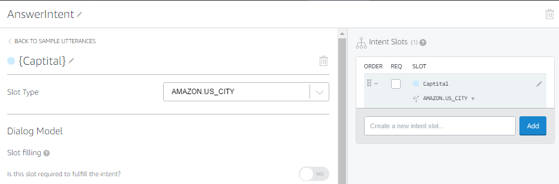
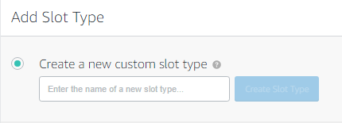

# Build An Alexa Fact Skill

## Setting up Your Alexa Skill in the Developer Portal

There are two parts to an Alexa skill.  The first part is the [Voice User Interface (VUI)](https://developer.amazon.com/public/solutions/alexa/alexa-skills-kit/docs/defining-the-voice-interface).  This is where we define how we will handle a user's voice input, and which code should be executed when specific commands are uttered.  The second part is the actual code logic for our skill, and we will handle that on [page #2](https://github.com/alexa/skill-sample-nodejs-fact/blob/master/step-by-step/2-lambda-function.md) of this step-by-step guide.

1.  **Go to the [Amazon Developer Portal](http://developer.amazon.com).  In the top-right corner of the screen, click the "Sign In" button.**  (If you don't already have an account, you will be able to create a new one for free.)

    

2.  **Once you have signed in, click the Alexa button at the top of the screen.**

    

3.  **On the Alexa page, choose the "Get Started" button for the Alexa Skills Kit.**

    

4.  **Select "Add A New Skill."** This will get you to the first page of your new Alexa skill.

    

5.  **Fill out the Skill Information screen.**  Make sure to review the tips we provide below the screenshot.

    

    ### Skill Information Tips
    1.  **Skill Type** For this skill, we are creating a skill using the Custom Interaction Model.  This is the default choice.

    2.  **Language** Choose the first language you want to support.  You can add additional languages in the future, but we need to start with one.  (This guide is using U.S. English to start.)

    3.  **Name** This is the name that will be shown in the Alexa Skills Store, and the name your users will refer to.

    4.  **Invocation Name** This is the name that your users will need to say to start your skill.  We have provided some common issues developers encounter in the list below, but you should also review the entire [Invocation Name Requirements](https://developer.amazon.com/public/solutions/alexa/alexa-skills-kit/docs/choosing-the-invocation-name-for-an-alexa-skill).

        | Invocation Name Requirements | Examples of incorrect invocation names |
        | ---------------------------- | -------------------------------------- |
        | The skill invocation name must not infringe upon the intellectual property rights of an entity or person. | korean air; septa check |
        | Invocation names should be more than one word (unless it is a brand or intellectual property), and must not be a name or place | horoscope; trivia; guide; new york |
        | Two word invocation names are not allowed when one of the words is a definite article, indefinite article, or a preposition | any poet; the bookie; the fool |
        | The invocation name must not contain any of the Alexa skill launch phrases and connecting words.  Launch phrase examples include "launch," "ask," "tell," "load," and "begin."  Connecting word examples include "to," "from," "by," "if," "and," "whether." | trivia game for star wars; better with bacon |
        | The invocation name must not contain the wake words "Alexa," "Amazon," "Echo," or the words "skill" or "app." | hackster initial skill; word skills |
        | The invocation name must be written in each language you choose to support.  For example, the German version of your skill must have an invocation name written in German, while the English (US) version must have an invocation name written in English. | kitchen stories (German skill) |

    5.  **Audio Player** For this Quiz skill, we won't be using any audio files, so you can select No for this option.  If you would like to learn more about adding audio to your skills, please check out our [Audio Player Guide](https://github.com/alexa/skill-sample-nodejs-audio-player).

6.  **Click the Next button to move to the Interaction Model.**

    

7.  Click on the **Launch Skill Builder** (Beta) button. This will launch the new Skill Builder Dashboard.

    

8.  Click on the "Add+" button near **Intents** on the top left corner of the dashboard.

    

    OPTIONAL: You can choose to upload a file to fill out your interaction model. To do that for this sample click on the </> Code Editor tab and drag the JSON file, IntentSchema.json, from the speechAssets folder of the sample code to the cloud upload icon. Once you're done, click Apply Changes. You can follow along with the rest of steps to see how things work or move onto step 9.

9.  Select **Use an existing intent from the built-in library**. In the textbox provided enter **AMAZON.StartOverIntent** or select that intent from the list of matching intents as they appear, then click the **Add Intent** button.

    

10. Next we will create a custom intent to allow users to ask questions about States. Click on the "Add+" button near **Intents** on the top left corner of the dashboard. Select **Create a new custom intent** and enter **AnswerIntent** in the textbox.

11. Add some sample utterances for the intent.  These are the things a user would say to make this intent happen.  Enter the following:

    * tell me about {StatehoodOrder}
    * tell me about {StatehoodYear}
    * tell me about {Capital}
    * tell me about {State}
    * tell me about {Abbreviation}

      As you type the utterances you will notice that words within {} are automatically converted into "slots" (right hand panel). When we have completed entering the utterances we will "configure them" so that they can be used in our code.

  

12. Define the **Slot Type** for newly created **Slots**. In the right hand panel select the slot called **Capital** and click on its **Edit** icon. From the **Slot Type** dropdown select the predefined slot type **AMAZON.US_CITY**.  Repeat for all the other slots setting the following slot names to predefined types as shown:

  * **StatehoodYear**  to AMAZON.FOUR_DIGIT_NUMBER
  * **StateName** to AMAZON.US_STATE
  * **StatehoodOrder** to AMAZON.NUMBER
13. For the **Abbreviation** slot name we must create a custom slot type. Click on the "Add+" button for **Slot Types** in the bottom left panel and enter **US_STATE_ABBR**, then select it from the "Slot Type" panel and enter abbreviations for all the States in the USA.

    

14. Next add a Custom intent that will allow users to start a quiz. Click on the "Add+" intent button and select **Create a new custom intent** then enter **QuizIntent** in the textbox. Add the following in the **Sample Utterances** field:

    * start a quiz
    * start a quiz game
    * quiz me

15. Finally Click on the **Save Model** button, and then click on the **Build Model** button.

    

 If you get an error from your interaction model, check through this list:
 * **Did you copy & paste the provided code into the appropriate boxes?**
 * **Did you accidentally add any characters to the Interaction Model or Sample Utterances?**

 In the next step of this guide, we will create our Lambda function in the AWS developer console, but keep this browser tab open, because we will be returning here on [Page #3: Connect VUI to Code](3-connect-vui-to-code.md).

  

  

